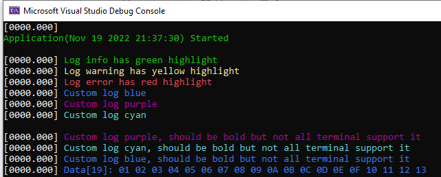

# The "log_" - Log Underscore
Simple debug output logger, color supported!

1. Clone repo and add log_.c file to your project
2. Rename log_conf_template.h to log_conf.h and change default config if needed
3. Rename log_io_template.h to log_io.h and fill configured functions

Example of usage:

```
#include "log_.h"
#include "log_io.h"

int main (void) {

#if LOG_ENABLED == 1U
    /* log_io_interface - defined and filled in log_io.h */
    log_init(LOG_MASK_ALL, &log_io_interface);
#endif  // LOG_ENABLED == 1U
   
    LOG_INFO("\r\nApplication(" __DATE__ " " __TIME__ ") Started\r\n");

    LOG_INFO("Log info has green highlight");
    LOG_WARNING("Log warning has yellow highlight");
    LOG_ERROR("Log error has red highlight");

    LOG(LOG_MASK_DEBUG, LOG_COLOR(LOG_COLOR_BLUE) "Custom log blue");
    LOG(LOG_MASK_DEBUG, LOG_COLOR(LOG_COLOR_PURPLE) "Custom log purple");
    LOG(LOG_MASK_DEBUG, LOG_COLOR(LOG_COLOR_CYAN) "Custom log cyan\r\n");

    LOG(LOG_MASK_DEBUG, LOG_BOLD(LOG_COLOR_PURPLE) "Custom log purple, should be bold but not all terminal support it");
    LOG(LOG_MASK_DEBUG, LOG_BOLD(LOG_COLOR_CYAN) "Custom log cyan, should be bold but not all terminal support it");
    LOG(LOG_MASK_DEBUG, LOG_BOLD(LOG_COLOR_BLUE) "Custom log blue, should be bold but not all terminal support it");

    uint8_t data[] = { 1, 2, 3, 4, 5, 6, 7, 8, 9, 10, 11, 12, 13, 14, 15, 16, 17, 18, 19 };
    LOG_DEBUG_ARRAY_BLUE("Data", data, sizeof(data));

   for(;;) {
   }
}
```

Example of output:

Visual Studio project output, timestamp and color enabled:



Example of Teraterm receiving data from serial port, timestamp and color enabled:


